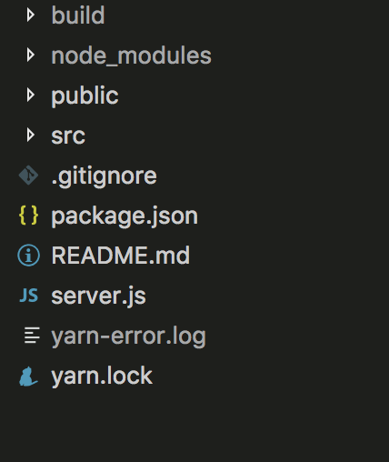

# Deploy React app with Node js

This is the first time I work on server stuffs, so my context is that I have to deploy my app in my Ubuntu server: The frontend is built from create-react-app, the node API is run with PM2 process manager on top, Nginx load balancer to proxy those app, and the Mongodb behind.

This article is noted when I proccessed my work, save for later for me as well. You could see this article as an example.

### Design containers structure
`/srv` is a good place to contain my app, it's a blank directory.

```
srv/
|
├─ node/
│ ├─ frontend
│ ├─ api
│ ├─ process.yml
│ └─ Dockerfile
│
├─ mongo/
│ ├─ run.sh
│ ├─ set_mongodb_password.sh
│ └─ Dockerfile
│
└─ docker-compose.yml
```

## Prepare to start.
I installed Ubuntu (currently lts 16.04) to my server.

### Install Docker and docker-compose

[Install docker](https://docs.docker.com/engine/installation/linux/docker-ce/ubuntu/)

[Learn more about Docker CE](https://docs.docker.com/engine/installation/linux/docker-ce/ubuntu/)

Install docker-compose, open terminal
```t
curl -o /usr/local/bin/docker-compose -L "https://github.com/docker/compose/releases/download/1.17.1/docker-compose-$(uname -s)-$(uname -m)"
chmod +x /usr/local/bin/docker-compose
```
You can check docker compose version with `docker-compose -v`

*For services image installation, I check at [docker hub](https://hub.docker.com) and pull decided version as my need.*

## Prepair your react app to serve dynamically
I use `create-react-app` starter kit for my front end, and to serve the built react application, I prefer to use `express` to run under `node`.
Open your React app and add dependencies.

```json
{
  "devDependencies": {
    "body-parser": "^1.18.2",
    "express": "^4.16.2",
    "path": "^0.12.7"
  }
}
```

Create `serve.js` in the app directory.



**server.js**
```js
  const express = require('express');
  const bodyParser = require('body-parser')
  const path = require('path');
  const app = express();

  app.disable('x-powered-by');
  app.use(express.static(path.join(__dirname, 'build')));

  app.get('*', function (req, res) { //need to declare a "catch all" route on your express server that captures all page requests and directs them to the client
    res.sendFile(path.join(__dirname, 'build', 'index.html'));
  });

  app.listen(
    process.env.PORT || 5000,
    function () {
      console.log(`Frontend start on http://localhost:5000`)
    }
  );
```
Add proxy to the `package.json`

```json
{
  "proxy": "http://localhost:5000",
}
```

**TL;DR** You can add proxy as `0.0.0.0:5000` if you get proxy notification in your console i you have some custom files in `public` directory need to proxy.

Open terminal and run the command like `node server.js`

You will see you app's running on the `localhost:5000` absolutely.

Commit and push your code.

## Git your repositories
The optional convenience way to get your code on server is to pull code from your repositories on Bitbucket, Github...You would prefer Docker hub repo, it's an option.

```sh
apt-get update
apt-get install git
```

Config your Git

```sh
git config --global user.name "Your Name"
git config --global user.email "youremail@domain.com"
```
To edit you Git config, use `nano ~/.gitconfig`

Clone your repo to `/srv`

```sh
cd /srv
git clone [myrepo@link]
```

Now, I can pull the repo everytime I need it.

## docker-compose.yml
Use docker compose to run docker commands once.
So create `docker-compose.yml`

```yaml
version: '3'
services:
  ####################
  # FRONTEND
  ####################
  frontend:
    image         : node:carbon
    container_name: React
    build         : ./node
    ports         :
      - "5000"
  #####################
  # NGINX
  #####################
  nginx:
    image         : nginx:stable
    container_name: Nginx
    build         : ./nginx
    links         :
      - frontend
    ports:
      - "80:80"
      - "443:443"
```

## React frontend
Create Dockerfile in `srv/node` directory

```Dockerfile
# Install dependencies
FROM ubuntu:16.04
# Clean and update
RUN apt-get clean && apt-get update
RUN apt-get -y install curl && \
    apt-get -y install wget && \
    apt-get -y install apt-utils && \
    apt-get autoremove -y
# Node app
FROM node:carbon
# The base node image sets a very verbose log level.
ENV NPM_CONFIG_LOGLEVEL warn
# Add package.json to cache the file
ADD frontend/package.json /tmp/frontend/

# Copy package json files for services
COPY frontend/package.json /srv/www/frontend/
# Set working dir
WORKDIR /srv/www
# Bundle app source
COPY . ./

# Install app dependencies
# To mitigate issues with npm saturating the network interface we limit the number of concurrent connections
RUN npm config set maxsockets 5 && npm config set progress false
RUN cd /srv/www/frontend && npm install && npm run build

# Install pm2
RUN npm install -g pm2
# Actual script to start can be overridden from `docker run`
CMD ["pm2", "start", "process.yml", "--no-daemon"]

# Expose ports
EXPOSE 5000
```

PM2 will start the services instead of Node, the process via `process.yml`

Open `process.yml` file
```yml
apps:
  - name     : 'frontend'
    script   : 'server.js'
    cwd      : '/srv/www/frontend'
    exec_mode: 'cluster'
    instance : 'max'
    env      :
      NODE_ENV: production
```

## Nginx
Nginx works as load balancer on the server.
In `/srv/nginx` directory, create `Dockerfile`

```Dockerfile
# Set nginx base image
FROM nginx
# Remove the default Nginx configuration file
RUN rm -v /etc/nginx/nginx.conf
# Copy custom configuration file from the current directory
COPY nginx.conf /etc/nginx/nginx.conf
# Append "daemon off;" to the beginning of the configuration
# in order to avoid an exit of the container
RUN echo "daemon off;" >> /etc/nginx/nginx.conf
# Expose ports
EXPOSE 80
# Define default command
CMD service nginx start
```
Then I create `nginx.conf` file

```conf
worker_processes  1;

events {
  worker_connections 1024;
}

http {
  proxy_cache_path /var/cache/nginx levels=1:2 keys_zone=one:10m;
  proxy_temp_path /var/tmp;
  gzip on;
  gzip_comp_level 4;
  gzip_min_length 500;

	upstream node {
		server frontend:5000 weight=10 max_fails=3 fail_timeout=30s;
	}
  #####################
  # FRONTEND
  #####################
	server {
		listen 80;
		root /srv/www/frontend;
		index index.html index.htm;
		server_name alphadev.we-mak.com;

		location / {
			proxy_pass http://node/;
			proxy_http_version 1.1;
			proxy_set_header Upgrade $http_upgrade;
			proxy_set_header Connection 'upgrade';
			proxy_set_header Host $host;
			proxy_cache_bypass $http_upgrade;
		}
	}
}
```

## Mongodb
Time to prepare Mongodb for the API.

Open `docker-compose.yml`, add
```yml
  ####################
  # MONGO
  ####################
  mongodb:
    image         : mongo:latest
    container_name: Database
    build         : ./mongo
    ports:
      - 27017:27017
```
In `/srv/mongo` I have 3 files:

**Dockerfile**
```Dockerfile
FROM mongo:latest
ENV AUTH yes
ENV STORAGE_ENGINE wiredTiger
ENV JOURNALING yes
ADD run.sh /run.sh
ADD set_mongodb_password.sh /set_mongodb_password.sh

CMD ["/run.sh"]
```

**run.sh**
```sh
#!/bin/bash
set -m

mongodb_cmd="mongod --storageEngine $STORAGE_ENGINE"
cmd="$mongodb_cmd --httpinterface --rest --master"
if [ "$AUTH" == "yes" ]; then
    cmd="$cmd --auth"
fi

if [ "$JOURNALING" == "no" ]; then
    cmd="$cmd --nojournal"
fi

if [ "$OPLOG_SIZE" != "" ]; then
    cmd="$cmd --oplogSize $OPLOG_SIZE"
fi

$cmd &

if [ ! -f /data/db/.mongodb_password_set ]; then
    /set_mongodb_password.sh
fi

fg
```

**set_mongodb_password.sh**

```sh
#!/bin/bash

# Admin User
MONGODB_ADMIN_USER=${MONGODB_ADMIN_USER:-"admin"}
MONGODB_ADMIN_PASS=${MONGODB_ADMIN_PASS:-"4dmInP4ssw0rd"}

# Application Database User
MONGODB_APPLICATION_DATABASE=${MONGODB_APPLICATION_DATABASE:-"admin"}
MONGODB_APPLICATION_USER=${MONGODB_APPLICATION_USER:-"restapiuser"}
MONGODB_APPLICATION_PASS=${MONGODB_APPLICATION_PASS:-"r3sT4pIp4ssw0rd"}

# Wait for MongoDB to boot
RET=1
while [[ RET -ne 0 ]]; do
    echo "=> Waiting for confirmation of MongoDB service startup..."
    sleep 5
    mongo admin --eval "help" >/dev/null 2>&1
    RET=$?
done

# Create the admin user
echo "=> Creating admin user with a password in MongoDB"
mongo admin --eval "db.createUser({user: '$MONGODB_ADMIN_USER', pwd: '$MONGODB_ADMIN_PASS', roles:[{role:'root',db:'admin'}]});"

sleep 3

# If we've defined the MONGODB_APPLICATION_DATABASE environment variable and it's a different database
# than admin, then create the user for that database.
# First it authenticates to Mongo using the admin user it created above.
# Then it switches to the REST API database and runs the createUser command
# to actually create the user and assign it to the database.
if [ "$MONGODB_APPLICATION_DATABASE" != "admin" ]; then
    echo "=> Creating an ${MONGODB_APPLICATION_DATABASE} user with a password in MongoDB"
    mongo admin -u $MONGODB_ADMIN_USER -p $MONGODB_ADMIN_PASS << EOF
use $MONGODB_APPLICATION_DATABASE
db.createUser({user: '$MONGODB_APPLICATION_USER', pwd: '$MONGODB_APPLICATION_PASS', roles:[{role:'dbOwner', db:'$MONGODB_APPLICATION_DATABASE'}]})
EOF
fi

sleep 1

# If everything went well, add a file as a flag so we know in the future to not re-create the
# users if we're recreating the container (provided we're using some persistent storage)
echo "=> Done!"
touch /data/db/.mongodb_password_set

echo "========================================================================"
echo "You can now connect to the admin MongoDB server using:"
echo ""
echo "    mongo admin -u $MONGODB_ADMIN_USER -p $MONGODB_ADMIN_PASS --host <host> --port <port>"
echo ""
echo "Please remember to change the admin password as soon as possible!"
echo "========================================================================"
```

Open terminal, in the `/srv/mongo` directory, run chmod commands:
```sh
chmod +x run.sh
chmod +x set_mongodb_password.sh
```

## API


Open directory `cd /srv` in your terminal. Update, build, run your app for the first time
```sh
docker-compose up --build -d
docker-compose up
```

Nothing to update, run command like this

```sh
docker-compose build
docker-compose up
```

[more tuts](https://www.digitalocean.com/community/tutorials/how-to-remove-docker-images-containers-and-volumes)


Sometimes you need to clean you containers, images, below are *Tips* for some essencial docker commands
- View containers in directory `docker ps`
- View all containers `docker ps -a`
- Stop container `docker stop [container-name]`
- Kill container `docker rm [container-name]`
- Stop all containers `docker stop $(docker ps -a -q)`
- Kill all containers `docker rm $(docker ps -a -q)`
- Kill all images `docker rmi $(docker images -q)`

This process may not really good, but most of all is to make it work first, optimize it later. Dockerdize things make your deployment not being the hell of installation jobs anymore.

If you observe my process has any problems please comment for me. Thanks in advance.

## References
http://nodesource.com/blog/8-protips-to-start-killing-it-when-dockerizing-node-js/
http://blog.bejanalex.com/2017/03/running-mongodb-in-a-docker-container-with-authentication/
http://jdlm.info/articles/2016/03/06/lessons-building-node-app-docker.html
